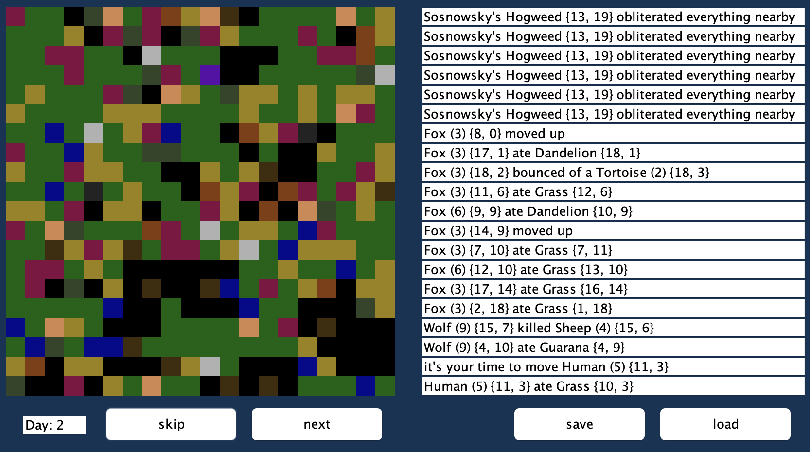

# JAVA_wildlife-sim

Turn-based wildlife ecosystem simulator written in Java, with a Swing GUI. Object-Oriented Programming course project.

A [C++ port of the same simulator](https://github.com/mi-zuri/CPP_wildlife-sim) and [Python port](https://github.com/mi-zuri/PY_wildlife-sim) also exists.

---



---

## What it simulates

A 20×20 grid world populated with organisms that act once per turn — moving, eating, reproducing, fighting, and dying.

**Animals:** Wolf, Fox, Sheep, Antelope, Tortoise, Human
**Plants:** Grass, Dandelion, Guarana, Belladonna, Sosnowsky's Hogweed

Each species has its own strength, speed, and collision behavior (e.g. Belladonna poisons whatever eats it; Guarana boosts strength; Hogweed kills in range).

The Human is a player-controlled organism with a single-use special ability.

## Features

- Swing GUI with clickable grid, status panel, and day counter
- Turn controls: **Skip**, **Next**, **Save**, **Load**
- Persistence via Java serialization (`save.ser`)
- Event log of everything that happens each turn

## Run

Open the project in IntelliJ IDEA (an `.iml` file is included) and run `Main`, or from the command line:

```bash
javac -d out src/**/*.java
java -cp out Main
```
